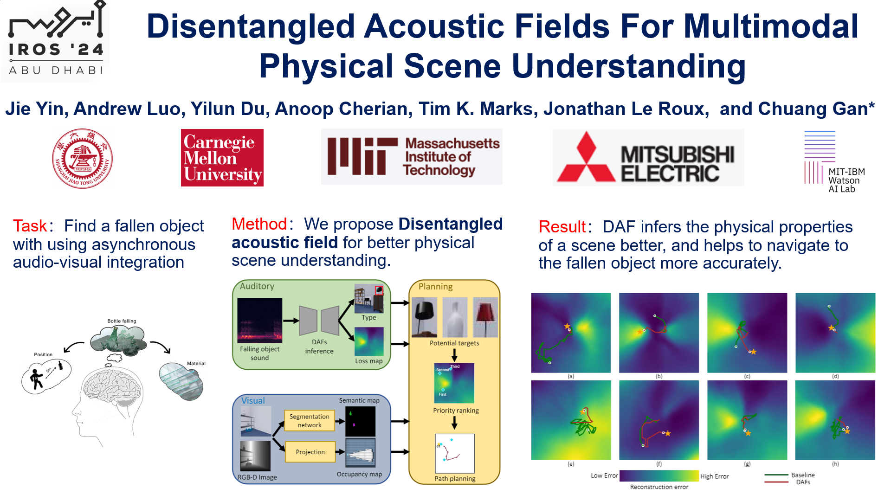

# Disentangled Acoustic Fields For Multimodal Physical Scene Understanding (IROS2024)

[Jie Yin](https://github.com/sjtuyinjie),
[Andrew Luo](https://www.cs.cmu.edu/~afluo/),
[Yilun Du](https://yilundu.github.io/),
[Anoop Cherian](http://users.cecs.anu.edu.au/~cherian/),
[Tim K. Marks](https://www.merl.com/people/tmarks)
[Jonathan Le Roux](https://www.jonathanleroux.org/)
[Chuang Gan](https://people.csail.mit.edu/ganchuang/)

📝 [[Paper]](https://github.com/sjtuyinjie/DAF/blob/main/daf_final.pdf)
&emsp;
➡️ [[Dataset]](https://github.com/chuangg/find_fallen_objects)
&emsp;
⭐️ [[Presentation Video]](https://youtu.be/QUIvWGnYkgk)

> [!NOTE]
> This website is for an overview of our work titled "Disentangled Acoustic Fields For Multimodal Physical Scene Understanding" in IROS2024. Currently we don't have plans for further release codes.

## Introduction
We study the problem of multimodal physical scene understanding, where an embodied agent needs to find fallen objects by inferring object properties, direction, and distance of an impact sound source. Previous works adopt feed-forward neural networks to directly regress the variables from sound, leading to poor generalization and domain adaptation issues. In this paper, we illustrate that learning a disentangled model of acoustic formation, referred to as disentangled acoustic field (DAF), to capture the sound generation and propagation process, enables the embodied agent to construct a spatial uncertainty map over where the objects may have fallen. We demonstrate that our analysis-by-synthesis framework can jointly infer sound properties by explicitly decomposing and factorizing the latent space of the disentangled model. We further show that the spatial uncertainty map can significantly improve the success rate for the localization of fallen objects by proposing multiple plausible exploration locations.
.

## Methodology
In the DAF pipeline, the encoder and decoder work together in an analysis-by-synthesis loop to infer object properties, with both components being trained jointly. For navigation with DAF, the planner uses the uncertainty map generated by DAF to prioritize locations, helping the agent efficiently locate the fallen object.

## Experiment
We conducted several experiments to evaluate DAF’s performance in inferring object properties. Results on the ObjectFolder2, Find Fallen Challenge, and Real-Impact datasets show significant improvements over baseline methods in predicting object properties.

Next, we explored DAF’s potential in navigation and planning. Our ablation studies demonstrate that incorporating the uncertainty map significantly improves the agent’s efficiency in searching for objects, reducing both path length and the number of actions taken. Moreover, our method generalizes well across different room types and layouts.

## Conclusion
1. This paper proposes an egocentric disentangled acoustic field framework that generalizes and reasons across various scenes by decomposing sound properties in the latent space. 

2. The method improves object localization success rates and generates multimodal uncertainty maps, demonstrating its potential for sound localization and understanding in complex environments.

